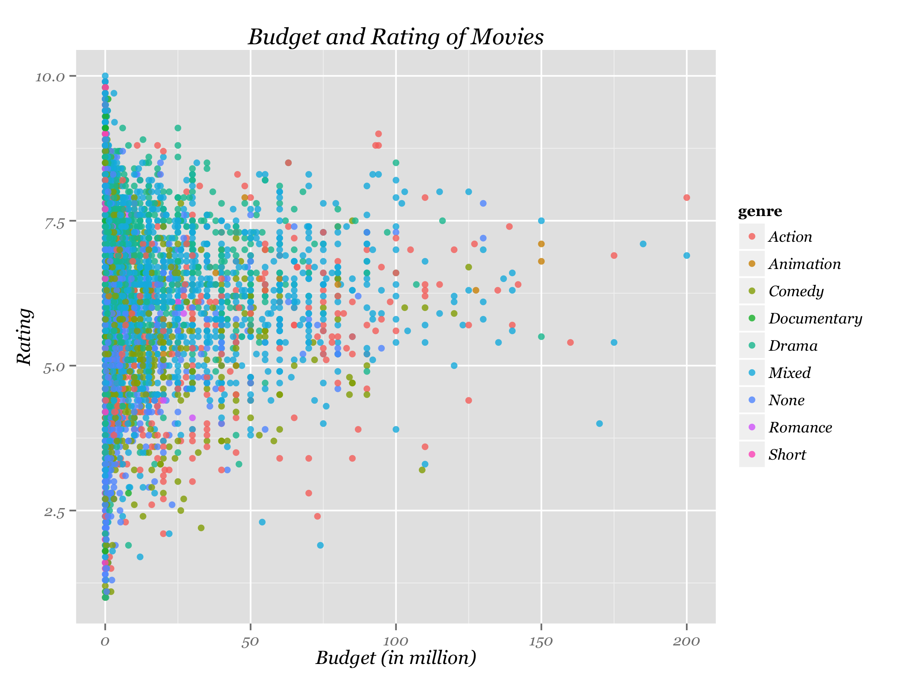
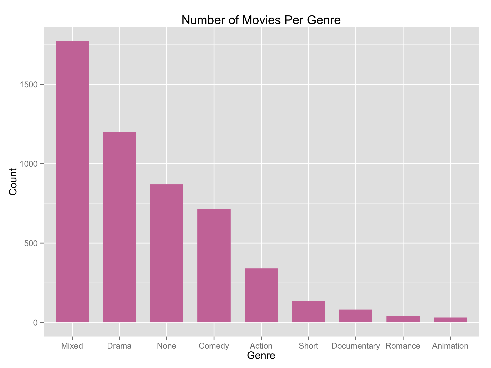
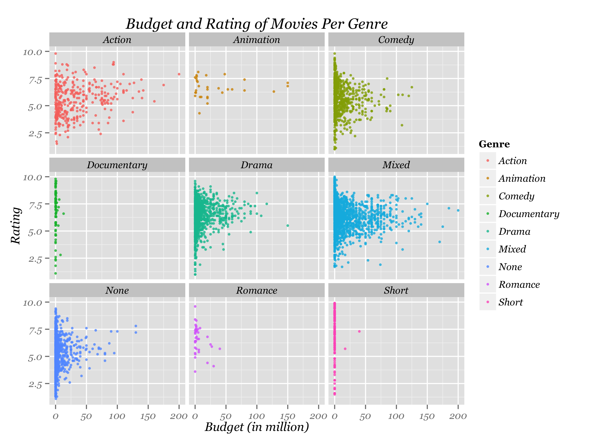
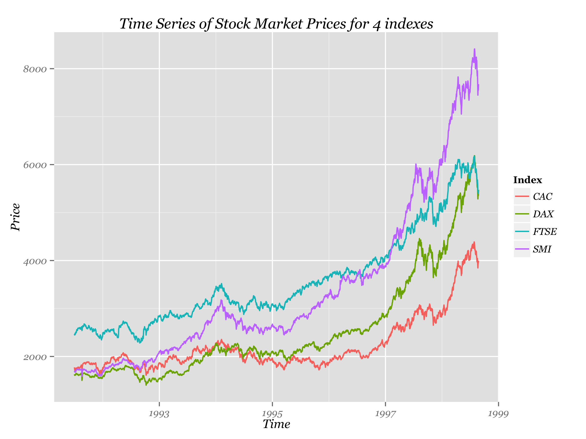

Homework 1: Basic Charts
==============================

| **Name**  | Katherine Zhao |
|----------:|:-------------|
| **Email** | mzhao12@dons.usfca.edu |

## Instructions ##

The following packages must be installed prior to running this code:

- `ggplot2`
- `devtools`

To run this code, please enter the following commands in R:

```
library(devtools)
source_url("https://raw.githubusercontent.com/katherinez22/msan622/master/homework1/homework1.R")
```

This will generate 4 images. See below for details.

## Discussion ##

- First, I produced a scatter plot from the movies dataset, where `budget` is shown on the x-axis and `rating` is shown on the y-aixs:



In order to have a good scale of the dollar amount showing on x-axis, I divided the `budget` column in movies dataset by 1,000,000 and showed the `budget` in million dollar. Also, I colored the scatters by genre to show the budget and rating for movies in various genre. This part is not required, but I tried to explore the parameters in `ggplot` function. Finally, I added the `alpha=.8` in `geom_point()` to increase the transparency of the points and make the points look softer. 

- Second, I counted the number of different categories in the genre column and showed the results as a bar chart:



In order to order plot the count per genre in a descending order, I created a variable `genretext` to store the genre names by the number of count in each genre. Then, I used `scale_x_discrete(limits=genretext)` to make the genre names on the x-axis to sort as a decending number of count. To beautify the graph, I adjusted the width and color of the bars using `width=0.7` and `fill="#CC79A7"`, respectively. 

- Third, I produced a small-multiples scatterplot, where `budget` is shown on the x-axis and `rating` is shown on the y-aixs:



In order to plot the `budget` and `rating` of movies per `genre`, I used `facet_wrap(~ genre, ncol=3)` where `ncol=3` will plot 9 subcharts in 3 columns. Then, I used `alpha=.8` in `geom_pint()` function to increase the transparency of the points and used `size=1.2` in `geom_pint()` function to control the size of points. Furthermore, I used `labs(colour="Genre")` to change the legend title to Genre. 

- Fourth, I produced a multi-line chart from `eu` dataset with time shown on the x-aix and `price` on the y-axis:



After converting values in `time` column into year, I created a new data frame with three columns to store the `price` and `time` for each `index`. Then, I grouped the prices and colored the lines using `group=factor(index)` and `color=factor(index)` in the `aes()`, respectively. Finally, I changed the size of lines using `size=0.6` in `geom_line()` function and changed the title of legend using `labs(colour="Index")`.

Font of title, x-label and y-label changed to Georgia Italic for all four graphs using `theme(text=element_text(family="Georgia", face="italic"))` function. 
