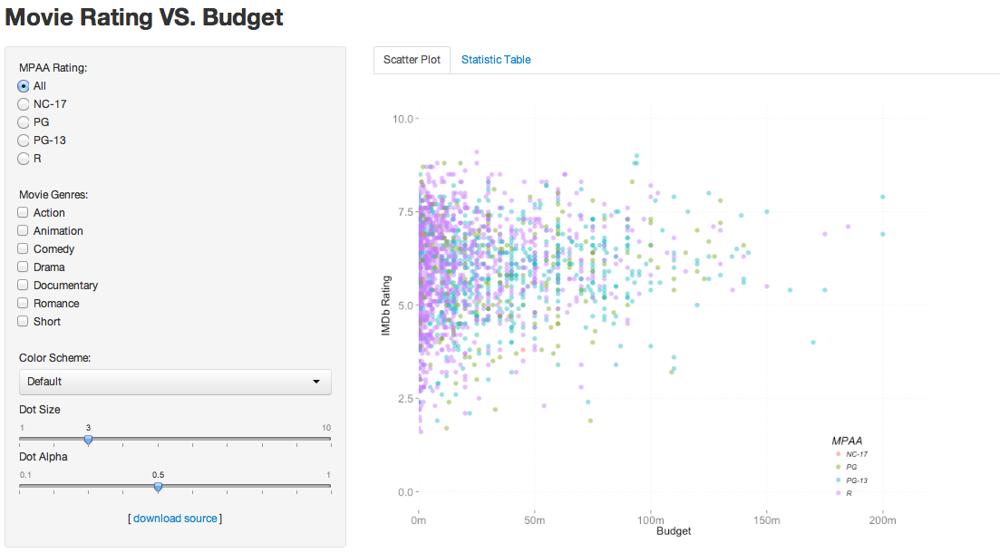

Homework 2: Interactivity
==============================

| **Name**  | Katherine Zhao  |
|----------:|:-------------|
| **Email** | mzhao12@dons.usfca.edu |

## Instructions ##

The following packages must be installed prior to running this code:

- `ggplot2`
- `shiny`

To run this code, please enter the following commands in R:

```
library(shiny)
shiny::runGitHub('msan622', 'katherinez22', 'homework2')
```

This will start the `shiny` app. See below for details on how to interact with the visualization.


## Discussion ##

### * Visualization
An interactive scatterplot of the `movies` dataset is created using the `ggplot2` and `shiny` packages. The basic scatterplot has `budget` on the x-axis, the IMDB `rating` on the y-axis, and dots colored by the `mpaa` rating.

By adding `MPAA Rating` radio buttons, a `Movie Genres` checkbox group, a `Color Scheme` drop-down box, a `Dot Size` slider input and a 'Dot Alpha' slider input, the screenshot of the visualization is as following:



To interact with the visualization, please follow the steps.

* Step 1: Selecting one `MPAA Rating`. The default value is `All`, which shows the scatter plot for movies with all ratings.

* Step 2: Checking one or multiple `Movie Genres` boxs. The default value is not checking any box, which shows the scatter plot for movies with all genres.

* Step 3: Choosing one `Color Scheme` from the drop-down list to visualize the plot with different color palettes. The default value is `Default`, which shows the scatter plot using the default color palette in `ggplot2`.

* Step 4: Choosing a `Dot Size` value by moving the slider bar. The default value is 3, which shows the dots with size equal to 3.

* Step 5: Choosing a `Dot Alpha` value by moving the slider bar. The default value is 0.5, which shows the dots with 50% transparency.

### * Customization
A few customizations were added for this visualization:

* First, removed the major panel grid on x-axis and y-axis using `panel.grid.major.x` and `panel.grid.major.y` in the `theme()` function, respectively. 

* Second, increased the sizes of axices texts and labels to 1.2 times using `axis.text.x`, `axis.text.y`, `axis.title.x`, 
and `axis.title.y` in the `theme()` function.

* Third, changed the font of legend text and table to italic using `legend.text` and `legend.title` in the `theme()` function, respectively. Also, moved the position of legend to the bottom of the plot using `theme(legend.position = "bottom")`.

* Fourth, created a tab panel to count the number of movies with different `MPAA Raint` and `Movie Genres` combination.

* Fifth, added a download link to allow users downloading the source code from a GitHub page. 

