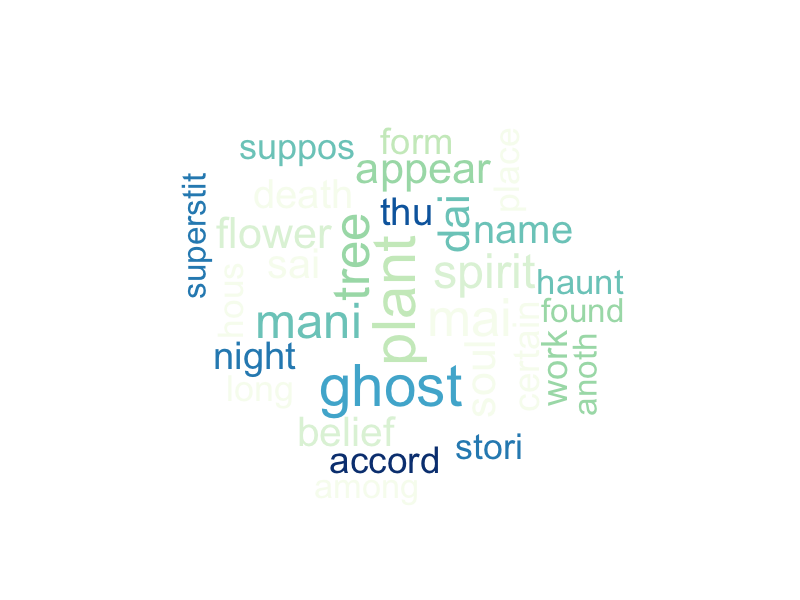
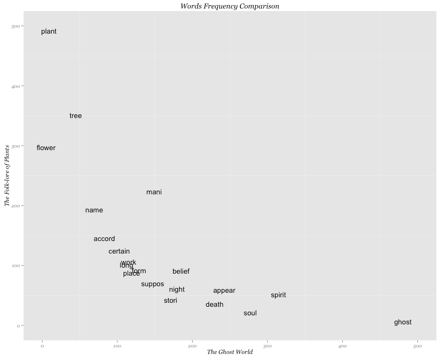

Homework 4: Text Visualization
==============================

| **Name**  | Katherine Zhao  |
|----------:|:-------------|
| **Email** | mzhao12@dons.usfca.edu |

## Instructions ##

The following packages must be installed prior to running this code:

- `ggplot2`
- `tm`
- `wordcloud`
- `SnowballC`
- `devtools`

To run this code, please enter the following commands in R:

```
library(devtools)
source_url("https://raw.githubusercontent.com/katherinez22/msan622/master/homework4/wordcloud.R")
source_url("https://raw.githubusercontent.com/katherinez22/msan622/master/homework4/barplot.R")
source_url("https://raw.githubusercontent.com/katherinez22/msan622/master/homework4/freqplot.R")
```

The text data are from two eBooks that wrote by T. F. Thiselton-Dyer: `The Folk-lore of Plants` and `The Ghost World`, which can be found on the Project Gutenberg through the following links:
`http://www.gutenberg.org/cache/epub/10118/pg10118.txt`;
`http://www.gutenberg.org/cache/epub/45362/pg45362.txt`.

## Discussion ##

T. F. Thiselton-Dyer was an English writer of popular non-fiction books, including British Customs: Past and Present, The Folk-lore of Plants, and perhaps most famously, Strange Pages from Family Papers, which was considered a masterpiece of popular historical writing. Two eBooks, The Ghost World and The Folk-lore of Plants, wroten by him were recently released on the Project Gutenberg website. Thus, I am interested in finding out what the common words he liked to use in him books.

After downloading the eBooks in `txt` format, data manipulation was performed using `tm` package. First, converted all words to lower case. Second, removed punctuation, numbers, white spaces, URLs, hyphens and stopwords from the corpus and stemmed all words in the corpus using Porter stemmer. The second step used `tm_map` function. Third, got the term document frequency matrix and controled the number of letters in each word is greater or equal to 4. Lastly, sorted the word by its frequency.

Since `The Folk-lore of Plants` is talking about plants and `The Ghost World` is related to ghost, the initial guess of the most frequent words in these two books are `plant` and `ghost`.

### Plot 1: Word Cloud ###

The first plot is a word cloud, which shows the top 50 frequent words in these two books. By setting `set.seed(375)`, the plot is reproducible whenever running the script. As consistant with the initial guess, the two big words pop out from the word cloud are `plant` and `ghost`. A few customizations were done in the `wordcloud` function: `scale`,  adjusting the size of the words showing on the plot, `random.order = FALSE`, plotting words by frequency and etc.



### Plot 2: Bar Plot ###

The second plot is a bar chart showing the top 10 frequent word stems of two books in decreasing order. The technique used for this plot is `ggplot2`. A few customizations: removed panel grid, axis ticks using `panel.grid = element_blank()` and `axis.ticks = element_blank()` in the `theme()` function; changed font of the title and labels using `text = element_text()` and etc.


### Plot 3: Frequency Plot ###

The third plot is a frequency plot showing the comparison of word frequency in the two books. By choosing the top 20 frequenct word in both books, the plot easily visualizes that the `ghost` has the highest frequency in `The Ghost World`, but has the lowest frequency in `The Folk-lore of Plants`. Similarly, the `plat` has the highest frequency in `The Folk-lore of Plants`, but has the lowest frequency in `The Ghost World`. `tree` and `ower` have relative higher frequency in `The Folk-lore of Plants`; `soul` and `spirit` have relative higher frequency in `The Ghost World`. This plot is the most interesting one. The technique used for this plot is also `ggplot2`. Instead of using `geom_bar` in the second plot, here `geom_text` was used. Similar customizations were used in this plot. 



