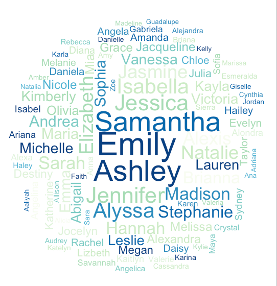
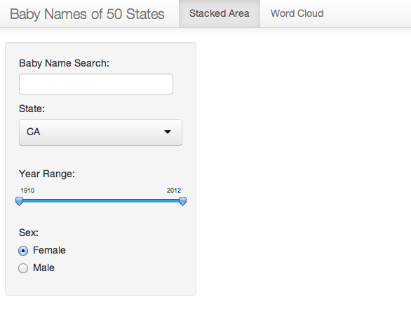
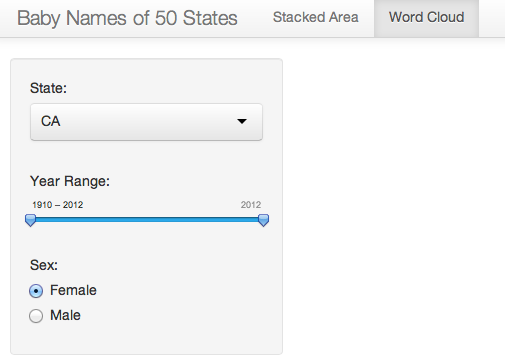

Project: Prototype
==============================

| **Name**  | Katherine Zhao  |
|----------:|:-------------|
| **Email** | mzhao12@dons.usfca.edu |

## Discussion ##

I plan to visualize the baby names data within 50 states using the shiny app. There will be three tab panels on the UI. 

First, I will provide a stacked area plot that enable a user to search a particular baby name starting with a certain character. For example, if a user search "Kat", the plot will show the all name trends starts with "Kat" from 1910 to 2012. This will include "Kathleen", "Katherine", "Kate" and etc. Also, within the shiny UI, a user can choose different combination of State, Sex, and Year Range to view the baby names over time. 

Second, I will provide a word cloud that visualize the top 100 words that match a certain criteria that a user selects in the shiny UI. Users can choose the year range, state, gender in this panel to view different word clouds.

Third, I am also trying to visualize the name density on the US Map, but didn't get it work yet. 

The interface of my shiny app is like the following:

