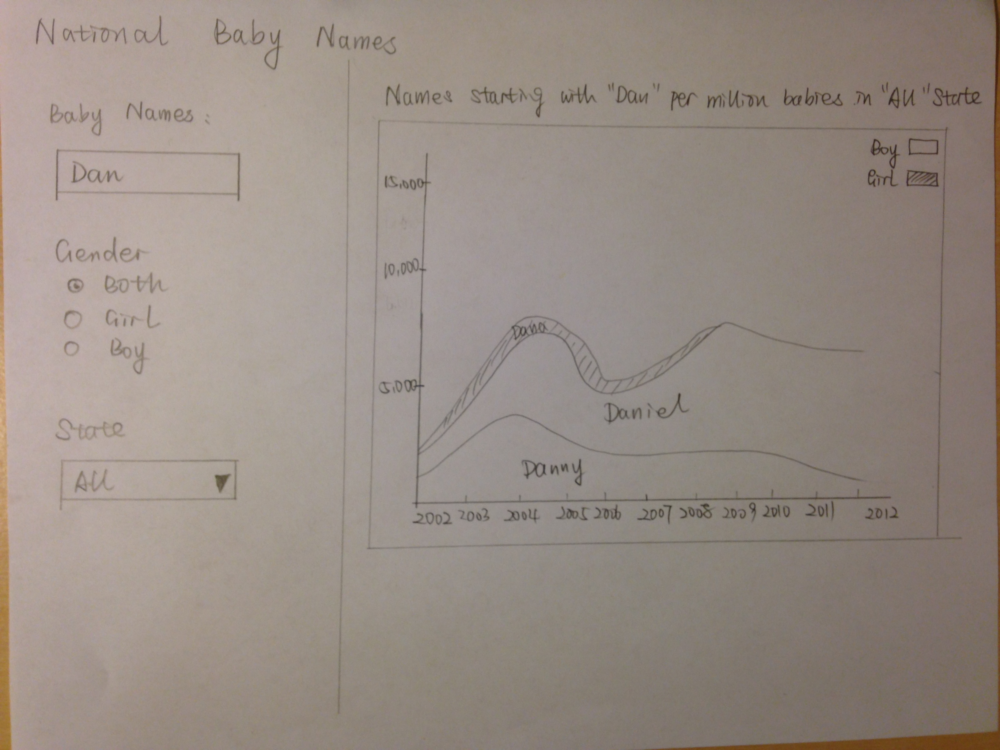

Project: Sketch
==============================

| **Name**  | Katherine Zhao  |
|----------:|:-------------|
| **Email** | mzhao12@dons.usfca.edu |

## Discussion ##

The dataset I choose includes top 1000 baby names in 50 states and the District of Columbia of United States from 2002 to 2012. The features included in this dataset are: `State`, `Sex`, `Year`, `Name`, `Number`. They represent 2-digit state code, sex (M = male or F = female), 4-digit year of birth (starting with 2002), the 2-15 character name, and the number of occurrences of the name, respectively.

The csv file is sorted first on `State`, then `Sex`, then `Year`, and then on `Number` in descending order. When there is a tie on the number of occurrences names are listed in alphabetical order. This sorting makes it easy to determine a name's rank. The first record for each sex & year of birth has rank 1, the second record has rank 2, and so forth.

Planned Tools
------------------------------

A few `R` packages I will use for this project will be a combination of `ggplot2`, `scales`, `tm`, `wordcloud`, `SnowballC` and `shiny`. I may also try the `ggmap` to visualize the baby names on US map.

Planned Techniques
------------------------------

With this dataset, first, I want to create Baby Name Wizard Graph of Most Popular Baby Names over the 10 years. `R` packages I will use in this graph will be a combination of `ggplot2`, `scales` and `shiny`.

Second, I want to create a word cloud showing the top ranked baby names in each year. `R` packages I will use in this graph will be a combination of `tm`, `ggplot2`, `wordcloud`, `SnowballC` and `shiny`.

Since I have the top ranked baby names by state, I also want to try visualize the baby names on the US map if I have extra time.

Planned Interaction
------------------------------

Types of interaction I want to include for this project are `filtering`, `sorting`, `brushing` and so forth.

For the first graph, I will create a search box to allow user to filter a particular baby name and visulize the trend of the name in the 10 years. 

For the second graph, I plan to filter the name by year and by state, and sort the baby names by the number of occurrences so that the world cloud can be viewed for each year. 

I may add more interaction techniques in my graphs and will explore them when plotting.

Planned Interface
------------------------------

